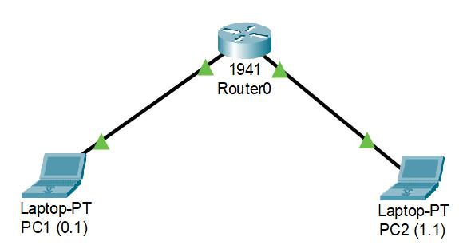

# 2台のpc間をciscoのルーターを使って疎通させたい！

### 用意したもの
* cisco packet tracer 8.2.1

ログインを求められるのでgmail等の捨てメアドでciscoのアカウント作るといいかもしれない。  
アカウント無しでもできると聞いたのですが私は作りました。


## 手順

### 1.機材を配置する
* laptop/tower問わず、pcを2台(以降pc1、pc2と記述)  
* router 1941を1台

上記の機材を配置し、straight-throughで結線を行う(⚡マーク→黒の実線)  
接続するインターフェースは以下の通り。ケーブルを選択しながら機材をクリックでインターフェース選択のタブが出てくる
* [pc1] Fastethernet 0 ----- Gigabitethernet 0/0 [router]
* [pc2] Fastethernet 0 ----- Gigabitethernet 0/1 [router]



インターフェースはLANケーブルを差し込む端子のルーター内部での呼び方で、パケットのやり取りをする装置のこと  
Fastethernet(PC側)とGigabitEthernet(ルーター側)が該当する

### 2.ルーターの設定
cisco packet tracerではルーターに対してGUIでの設定も行えるが、今回はCUIでの設定手法を紹介する

管理者権限で機器の設定を行えるモードへ移行する
```
router> enable              //特権(管理者)モードに移行
router# configure terminal  //設定モードへ移行
```

ルーターの各インターフェースにIPアドレスを割り振る  

```
//pc1とつながっている0/0インターフェース
router(config)# interface Gigabitethernet 0/0
router(config-if)# ip address 192.168.0.254 255.255.255.0
router(config-if)# no shutdown  //インターフェースを有効化
router(config-if)# exit         //ひとつ前のモードへ
router(config)#

//pc2とつながっている0/1インターフェース
router(config)# interface Gigabitethernet 0/1
router(config-if)# ip address 192.168.1.254 255.255.255.0
router(config-if)# no shutdown
router(config-if)# exit
```
* interface ~~~~  
ルーターのインターフェースに対して設定を行うためのコマンド  
インターフェースそれぞれに別の設定モードが用意されているので、設定したいインターフェースを指定して、モード移行します

* ip address 192.168.n.254 255.255.255.0  
ipアドレスを設定するコマンドで2種類のアドレスを指定している  
前者(192~)がIPアドレスで、後者(255~)はサブネットマスクという  
例えると住所と市区町村みたいな関係

* no shutdown  
cisco機器の各インターフェースは、初期状態がshutdown(=無効)に設定されているので  
no shutdown(shutdownを否定みたいなニュアンス)で使いたいインターフェースを有効化する

### 3.PCの設定
pcのアイコンをクリックすると、タブが出てくる  
タブ上部にあるdesktopから、"ipconfiguration"を選択  
pc1、2それぞれに以下の値を入力

|| pc1 | pc2 |
|---|:---:|:---:|
| ip address | 192.168.0.1 | 192.168.1.1 |
| subnet mask | 255.255.255.0 | 255.255.255.0 |
|dafault gateway | 192.168.0.254 | 192.168.1.254

ここまでの設定がうまくいっていれば、ルーター-pc間のケーブルについている△が赤から緑になっているはず

### 4.疎通確認
pcタブ上部のdesktopから、今度は"cmd"を選択  
windows同様、pingコマンド、tracertコマンドで疎通確認が可能

pc1(192.1680.1)からpc2(192.168.1.1)への疎通の様子
```
C\:>ping 192.168.1.1

Pinging 192.168.1.1 with 32 bytes of data:

Reply from 192.168.1.1: bytes=32 time<1ms TTL=127
Reply from 192.168.1.1: bytes=32 time<1ms TTL=127
Reply from 192.168.1.1: bytes=32 time<1ms TTL=127
Reply from 192.168.1.1: bytes=32 time<1ms TTL=127

Ping statistics for 192.168.1.1:
    Packets: Sent = 4, Received = 4, Lost = 0 (0% loss),
Approximate round trip times in milli-seconds:
    Minimum = 0ms, Maximum = 0ms, Average = 0ms
```

reply from ~というメッセージが表示されたら成功  
うまく届かないと、request timed out というメッセージが返ってくる  

これはパケットの生存時間を過ぎても、応答が返ってこないときのメッセージで、  
何らかの理由で、目的のホストに通信が届いていない可能性が高い  
理由としては、目的のホストが存在していない、ファイアウォールによって破棄されてしまったなどが考えられる

ルーターのコンフィグは"router-config.txt"として保存しているので  
気になったら覗いてみてください